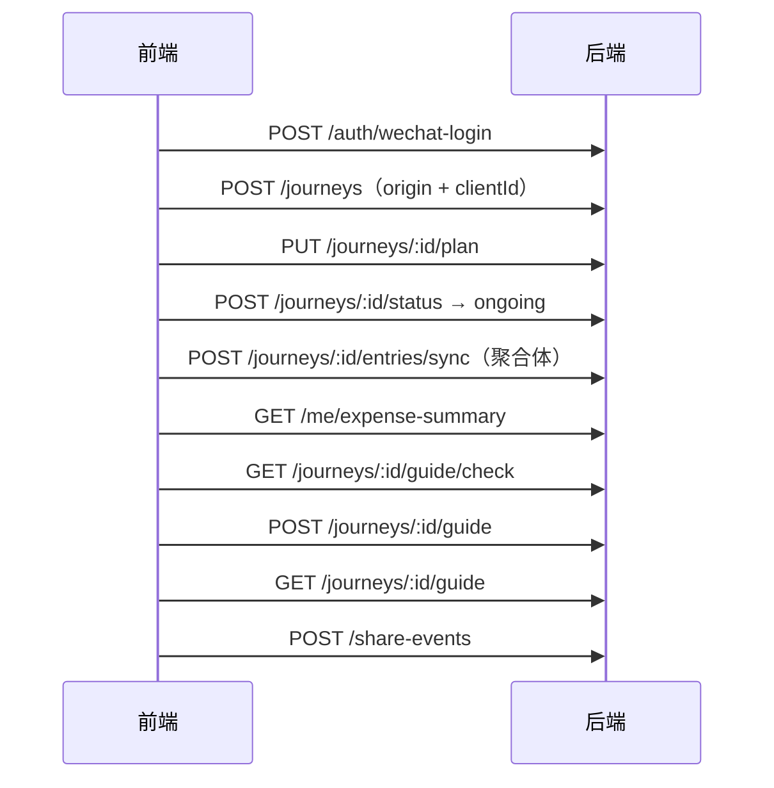

# 途记 · 前端对接接口文档

> Base URL：`http://localhost:3000/api/v1`  
> Swagger：`http://localhost:3000/api/docs`  
> 鉴权：除登录 / 假支付外，统一 `Authorization: Bearer <token>`  
> 金额单位：**分**（1 元 = 100）；语音配额单位：**秒**  
> 版本：v2.1（2026-07-22，对齐前端差异清单 P0+P1，并合入联调勘误）  
> **用库内假数据做第一版效果** → [真实数据联调对接文档.md](./真实数据联调对接文档.md)

---

## 0. 约定

### 0.1 成功 / 错误

- 成功：HTTP `2xx`，**裸 JSON**（无 `{ code, data }` 包装）。
- 错误：

```json
{
  "code": "Bad Request",
  "message": "具体原因",
  "timestamp": "2026-07-22T14:00:00.000Z",
  "path": "/api/v1/journeys"
}
```

| HTTP | 场景 |
|------|------|
| 400 | 校验失败 / 非法状态跃迁 / 攻略门槛 / 配额不足 / 内容违规 |
| 401 | 未登录 |
| 403 | 越权 |
| 404 | 资源不存在（含行级权限伪装） |

| code | 含义 |
|------|------|
| `GUIDE_NOT_READY` | 攻略内容不足 |
| `GUIDE_NOT_FOUND` | 该旅程尚无攻略（`exists: false`） |
| `QUOTA_EXCEEDED` | 照片/语音配额用尽 |
| `CONTENT_BLOCKED` | 文字未通过内容安全（`msgSecCheck`） |

删除类接口统一返回 `{ "deleted": true }` 或 `{ "deleted": N, ... }`。

### 0.2 枚举（英文 key；写入兼容中文别名）

#### 旅程状态 `status`

| 规范值（读出） | 写入别名 |
|----------------|----------|
| `planned` | `planning` |
| `ongoing` | — |
| `finished` | `ended` |

跃迁仅相邻：`planned ↔ ongoing ↔ finished`。

#### 主题 `themeTags` / `themes`

| key | 中文别名 |
|-----|----------|
| `city_walk` | 城市漫步 |
| `island` | 海岛 |
| `food` | 美食 |
| `family_kids` | 亲子 |
| `hiking` | 徒步 |
| `culture` | 人文 |
| `shopping` | 购物 |
| `relax` | 休养 |

#### 同行人 `companions`

| 规范值（读出） | 中文别名 | 写入别名 |
|----------------|----------|----------|
| `solo` | 自己 | — |
| `couple` | 情侣 | — |
| `friends` | 朋友 | — |
| `family` | 家庭 | — |
| `with_kids` | 带娃 | — |
| `pet` | 宠物 | `with_pet` |

> `solo` 不可与其它同行人同时出现。读出一律规范值（`pet`，不再返回 `with_pet`）。

#### 花费分类 `expense.category`

| key | 中文别名 |
|-----|----------|
| `food` | 餐饮 |
| `stay` | 住宿 |
| `transport` | 交通 |
| `ticket` | 门票 |
| `shopping` | 购物 |
| `other` | 其他 |

读出一律英文 key。

#### 分享 `channel`

| 规范值 | 别名 |
|--------|------|
| `friend` | — |
| `moments` | `timeline` |
| `image` | — |

### 0.3 演示账号

```http
POST /api/v1/auth/wechat-login
{"code":"dev_openid_demo"}
```

> 非生产环境即使已配置真实 `WX_APPID/SECRET`，`code=dev_openid_demo` 仍可登录种子账号。  
> 重置假数据：`npm run seed:demo`（会同步表结构并重建完整联调样本）

| 对象 | ID / clientId | 说明 |
|------|----------------|------|
| 演示用户 | `aaaaaaaa-…111` / `dev_openid_demo` | 途记演示 |
| 曼谷泼水节 | `…0001` / `j_bangkok` | planned，有计划+预消费，无攻略 |
| 京都红叶 | `…0002` / `j_kyoto` | ongoing，时间线最全，已有攻略+收藏+分享 |
| 冰岛环岛 | `…0003` / `j_iceland` | finished，环岛叙事+攻略 |
| 大理慢生活 | `…0004` / `j_dali` | finished，攻略已收藏 |

---

## 1. 鉴权 / 用户 / 配额 / 隐私

### 1.1 微信登录

`POST /auth/wechat-login`（无需 Bearer）

```json
{ "code": "wx.login code；dev 可直接传 openid" }
```

```json
{
  "token": "eyJ...",
  "user": {
    "id": "uuid",
    "openid": "...",
    "nick": null,
    "nickname": null,
    "avatar": null,
    "plan": "free",
    "quotaPhoto": 50,
    "quotaVoiceSec": 3600,
    "usedPhoto": 0,
    "usedVoiceSec": 0
  }
}
```

> `nick` 与 `nickname` 同值；PATCH 写入二者皆可。

token 有效期 7 天。

### 1.2 资料

`GET /me` · `PATCH /me` `{ "nick" | "nickname", "avatar" }`

### 1.3 配额

`GET /me/quota`

```json
{
  "plan": "free",
  "photo": { "used": 3, "quota": 50, "remaining": 47 },
  "voiceSec": { "used": 120, "quota": 3600, "remaining": 3480 }
}
```

### 1.4 年度预算（多端同步）

`GET /me/budget?year=2026`  
`PATCH /me/budget`

```json
{ "year": 2026, "amountCent": 500000 }
```

```json
{ "year": 2026, "amountCent": 500000, "updatedAt": "..." }
```

未设置过则 `amountCent: 0`。

### 1.5 全局花费汇总（记账 Tab）

`GET /me/expense-summary?year=2026`

```json
{
  "year": 2026,
  "totalCent": 1280000,
  "count": 42,
  "journeyCount": 3,
  "destCount": 2,
  "byCategory": [
    { "category": "food", "amountCent": 6800, "ratio": 0.53, "count": 5 }
  ],
  "byMonth": [
    {
      "month": 7,
      "amountCent": 200000,
      "journeyIds": ["uuid-a", "uuid-b"],
      "journeyTitles": ["曼谷泼水节", "京都红叶"]
    }
  ],
  "byJourney": [
    {
      "journeyId": "...",
      "title": "...",
      "destination": "曼谷",
      "coverUrl": "https://...",
      "status": "finished",
      "themeTags": ["food", "city_walk"],
      "totalCent": 50000,
      "count": 8,
      "budgetAmount": 600000
    }
  ]
}
```

| 字段 | 说明 |
|------|------|
| `journeyCount` / `destCount` | 有花费的旅程数 / 目的地去重数（空 destination 不计） |
| `byCategory[].count` | 该分类笔数 |
| `byMonth` | 仅含 `amountCent > 0` 的月份也可返回全 1–12（缺月为 0）；`journeyTitles` 便于趋势文案 |
| `byJourney` | 封面 / 状态 / 目的地 / 主题供记账列表直接渲染；目的地 Tab 可由前端按 `destination` 归并 |

> 目的地区域归并（日本/泰国/国内等）由前端完成，后端只给原始 `destination`。

### 1.6 隐私

| 方法 | 路径 | 说明 |
|------|------|------|
| `GET` | `/me/export` | PIPL 全量导出（含坐标） |
| `DELETE` | `/me/locations` | 清本人全部位置 |
| `DELETE` | `/journeys/:id/locations` | 清该旅程位置 |

清位置：`{ "deleted": N }`

---

## 2. R1 旅程

### 2.1 新建

`POST /journeys`

```json
{
  "clientId": "local-journey-uuid",
  "title": "曼谷泼水节",
  "origin": "杭州",
  "destination": "曼谷",
  "startDate": "2026-04-10",
  "endDate": "2026-04-16",
  "coverUrl": "https://...",
  "themeTags": ["culture", "food"],
  "companions": ["couple"],
  "budgetAmount": 600000,
  "isPublic": false
}
```

| 字段 | 必填 | 说明 |
|------|------|------|
| `title` | ✅ | 1–128 |
| `origin` | ✅ | 出发地 1–128 |
| `destination` | ❌ | 目的地，可后补 |
| `startDate` / `endDate` | ✅ | `YYYY-MM-DD`，end ≥ start |
| `clientId` | ❌ | 按用户幂等；重复提交返回已有旅程 |
| `themeTags` / `themes` | ❌ | 英文 key 或中文别名 |
| `companions` | ❌ | 同上；`solo` 互斥 |
| `budgetAmount` / `budgetLimit` | ❌ | 分 |
| `coverUrl` / `cover` | ❌ | 封面 |

**列表项 Response**

```json
{
  "id": "uuid",
  "clientId": "local-journey-uuid",
  "userId": "uuid",
  "title": "曼谷泼水节",
  "origin": "杭州",
  "destination": "曼谷",
  "startDate": "2026-04-10",
  "endDate": "2026-04-16",
  "coverUrl": null,
  "status": "planned",
  "displayStatus": "departing",
  "themeTags": ["culture", "food"],
  "themes": ["culture", "food"],
  "companions": ["couple"],
  "budgetAmount": 600000,
  "budgetLimit": 600000,
  "isPublic": false,
  "syncVersion": 1,
  "days": 7,
  "nights": 6,
  "totalExpenseCent": 0,
  "expenseTotal": 0,
  "entryCount": 0,
  "recordCount": 0,
  "placeCount": 0,
  "planProgress": 50,
  "confirmedCount": 2,
  "todayPlaceCount": 0,
  "createdAt": "...",
  "updatedAt": "..."
}
```

| 派生字段 | 口径 |
|----------|------|
| `days` / `nights` | 由日期计算 |
| `totalExpenseCent` / `expenseTotal` | 已花（分），双字段同值 |
| `entryCount` / `recordCount` | 记录条数，双字段同值 |
| `placeCount` | 优先计划 `places.length`；无计划则带定位的 entry 数 |
| `themeTags` / `themes` | 主题，双字段同值 |
| `budgetAmount` / `budgetLimit` | 预算（分），双字段同值 |
| `coverUrl` / `cover` | 封面，双字段同值（有封面时） |
| `displayStatus` | 展示态（只读派生，不落库）：`planning` / `departing` / `ongoing` / `finished`（`draft` 预留） |
| `planProgress` | 计划完成度 0–100：`round(doneChecks / totalChecks * 100)`；无 checks → `0` |
| `confirmedCount` | 已勾选 checklist 数（与完成度同源） |
| `todayPlaceCount` | 仅 `displayStatus=ongoing` 时：当天有定位的记录数；否则 `0` |

**`displayStatus` 规则**（`status` 仍只读写三态 `planned|ongoing|finished`）：

| 值 | 条件 |
|----|------|
| `finished` / `ongoing` | 与持久化 `status` 一致 |
| `departing` | `status=planned` 且 `startDate` ∈ `[今天, 今天+3]` 且 `today ≤ endDate` |
| `planning` | `status=planned` 且不满足即将出发 |

新建时自动创建默认旅行计划（护照 / 签证、机票、酒店预订、换汇 / 流量卡）。

### 2.2 列表 / 详情 / 编辑 / 删除

| 方法 | 路径 | 说明 |
|------|------|------|
| `GET` | `/journeys?status=planned` | 按持久化三态筛选；`planned` 含规划中+即将出发 |
| `GET` | `/journeys?displayStatus=departing` | 按展示态筛选（`planning`/`departing`/`ongoing`/`finished`） |
| `GET` | `/journeys/:id` | 详情 + `plan` 嵌套（含 places/checks） |
| `PATCH` / `PUT` | `/journeys/:id` | 局部更新（二者等价） |
| `DELETE` | `/journeys/:id` | 级联删 entries / plan / guides 等 → `{ deleted: true }` |

### 2.3 状态切换 / 结束旅行

`POST /journeys/:id/status`（推荐）· `PATCH` 同路径兼容

```json
{ "target": "ongoing" }
```

兼容字段 `status`。别名：`planning`→`planned`，`ended`→`finished`。

```json
{ "id": "...", "status": "ongoing", "syncVersion": 2 }
```

**结束旅行（专用，无需 body）**

```http
POST /journeys/:id/finish
```

| 当前状态 | 行为 |
|----------|------|
| `ongoing` / `planned` | → `finished`；若 `endDate` 在未来则收口为今天 |
| `finished` | 幂等，直接返回旅程详情 |

响应为旅程列表项（含 `status` / `displayStatus` / `syncVersion` 等）。

等价于 `POST .../status` + `{ "target": "finished" }`，但 `planned` 也可直接结束（不必先切到进行中）。

---

## 2.x 统计模块

见独立文档：[`统计模块_接口文档.md`](./统计模块_接口文档.md)（`GET /stats/overview|expenses|plans|journeys|content|storage`）。

---

## 3. 旅行计划（屏 JourneyPlan）

> **新能力**：目的地 / 准备事项已拆独立表与 CRUD，见 [`目的地与准备事项_接口文档.md`](./目的地与准备事项_接口文档.md)。  
> 本节 `/plan` 仍可用（JSON places/checks）；卡片 `placeCount`/`planProgress` 优先读新表。

| 方法 | 路径 | 说明 |
|------|------|------|
| `GET` | `/journeys/:id/plan` | 无则返回默认空 places + 默认 checks |
| `PUT` | `/journeys/:id/plan` | 全量覆盖 |
| `PATCH` | `/journeys/:id/plan` | 局部；支持 `toggleCheckClientId` |

**PUT Body**

```json
{
  "places": [
    {
      "clientId": "p1",
      "name": "考山路",
      "note": "泼水节当晚",
      "coverUrl": "https://..."
    }
  ],
  "checks": [
    { "clientId": "c1", "text": "护照 / 签证", "done": true },
    { "clientId": "c2", "text": "机票", "done": true }
  ],
  "budgetEstimate": 600000
}
```

写入兼容：`id` 可作为 `clientId` 别名；`cover` 可作为 `coverUrl` 别名。

**PATCH 快捷 toggle**

```json
{ "toggleCheckClientId": "c1" }
```

亦接受 `{ "toggleCheckId": "c1" }`。

**Response**

```json
{
  "journeyId": "...",
  "places": [
    {
      "id": "p1",
      "clientId": "p1",
      "name": "考山路",
      "note": "泼水节当晚",
      "coverUrl": "https://...",
      "cover": "https://..."
    }
  ],
  "checks": [
    {
      "id": "default-passport",
      "clientId": "default-passport",
      "text": "护照 / 签证",
      "done": false
    },
    {
      "id": "default-flight",
      "clientId": "default-flight",
      "text": "机票",
      "done": false
    },
    {
      "id": "default-hotel",
      "clientId": "default-hotel",
      "text": "酒店预订",
      "done": false
    },
    {
      "id": "default-fx",
      "clientId": "default-fx",
      "text": "换汇 / 流量卡",
      "done": false
    }
  ],
  "budgetEstimate": 0,
  "updatedAt": "..."
}
```

> 读出同时带 `id` 与 `clientId`（同值）、`cover` 与 `coverUrl`（同值），方便前端少写映射。  
> 默认 checks 文案与前端 DEMO 一致。

删除旅程时级联删除 plan。

---

## 4. R2 记录（聚合体）

一条记录可同时含：文字 + 多图 + 语音 + 定位 + 花费。`type` 为展示主色 hint，可不传，服务端按内容推断（与前端 `inferRecordType` 对齐）。

主类型：`text` | `photo` | `voice` | `location` | `expense`

### 4.1 批量同步

`POST /journeys/:id/entries/sync`

按 `clientId` **幂等 upsert**（LWW）：已存在则更新，不存在则新建；整批同一事务。弱网重复提交不会产生脏数据。

```json
{
  "entries": [
    {
      "clientId": "rec-001",
      "content": "考山路夜市",
      "media": [
        { "url": "https://cdn/a.jpg", "kind": "photo", "size": 204800 },
        { "url": "https://cdn/b.jpg", "kind": "photo", "size": 180000 }
      ],
      "location": { "lat": 13.75, "lng": 100.5, "name": "考山路" },
      "expense": {
        "amountCent": 6800,
        "category": "food",
        "note": "夜市小吃"
      }
    },
    {
      "clientId": "rec-002",
      "type": "expense",
      "expense": {
        "amountCent": 12000,
        "category": "stay",
        "currency": "CNY",
        "note": "青旅一晚"
      }
    },
    {
      "clientId": "rec-003",
      "voice": { "url": "https://cdn/v.mp3", "durationSec": 12, "size": 102400 },
      "payload": { "durationSec": 12 }
    }
  ]
}
```

| 字段 | 说明 |
|------|------|
| `expense.amountCent` | ≥ 1，单位分；写入亦兼容 `amount` |
| `expense.note` | 可选备注 |
| `expense.category` | 英文 key 或中文别名；读出英文 key |
| `media[]` | 多图；每项需最终可访问 URL（见 §9 媒体流程） |
| `voice` | 语音；`durationSec` 与顶层 `payload.durationSec` 二选一即可 |

兼容旧字段：单媒体仍可传 `url` + `kind` + `size`。  
文字含违规内容 → `400` + `code: CONTENT_BLOCKED`。

```json
{
  "synced": [
    {
      "clientId": "rec-001",
      "id": "server-uuid",
      "syncVersion": 1,
      "status": "synced",
      "type": "photo"
    }
  ]
}
```

### 4.2 拉取时间线

`GET /journeys/:id/entries`

每条含 `location` / `expense` / `media[]` / `voice`，以及服务端计算的 **`dayIndex`**（相对旅程 `startDate`，从 1 起；早于出发日记为 1）。

```json
[
  {
    "id": "...",
    "clientId": "rec-001",
    "type": "photo",
    "content": "考山路夜市",
    "dayIndex": 2,
    "location": { "lat": 13.75, "lng": 100.5, "name": "考山路" },
    "expense": {
      "amountCent": 6800,
      "amount": 6800,
      "category": "food",
      "currency": "CNY",
      "note": "夜市小吃"
    },
    "media": [
      { "id": "...", "kind": "photo", "url": "https://cdn/a.jpg", "size": 204800 }
    ],
    "voice": null,
    "createdAt": "..."
  },
  {
    "id": "...",
    "clientId": "rec-003",
    "type": "voice",
    "content": "",
    "dayIndex": 2,
    "location": null,
    "expense": null,
    "media": [],
    "voice": {
      "url": "https://cdn/v.mp3",
      "durationSec": 12,
      "size": 102400
    },
    "payload": { "durationSec": 12 },
    "createdAt": "..."
  }
]
```

> 前端可将 `voice.url` → `voicePath`、`voice.durationSec` → `voiceDuration`；`media[].url` 收成 `string[]`。

### 4.3 删除

| 方法 | 路径 | Body |
|------|------|------|
| `DELETE` | `/journeys/:id/entries/:entryId` | — |
| `POST` | `/journeys/:id/entries/delete` | `{ entryIds }` 或 `{ from, to }` |

---

## 5. R3 地图

`GET /map/poi?keyword=考山路&lat=&lng=`  
`GET /map/reverse-geocode?lat=&lng=`

未配 key 时 `provider: "mock"`。

---

## 6. R4 单旅程花费

`GET /journeys/:id/expense-summary`

```json
{
  "journeyId": "...",
  "totalCent": 12800,
  "total": 12800,
  "count": 3,
  "byCategory": [
    { "category": "food", "amountCent": 6800, "ratio": 0.5313, "count": 2 }
  ],
  "byDay": [{ "date": "2026-04-11", "amountCent": 6800, "total": 6800 }]
}
```

| 字段 | 说明 |
|------|------|
| `totalCent` / `total` | 总额（分），双字段同值 |
| `count` | 花费笔数 |
| `byDay[].amountCent` / `total` | 当日合计，双字段同值 |

---

## 7. R5 攻略 / 分享

### 7.1 生成前检查

`GET /journeys/:id/guide/check`

门槛：≥2 条记录，且至少一张照片或一个定位。

```json
{
  "canGenerate": true,
  "reason": null,
  "stats": { "entryCount": 5, "hasPhoto": true, "hasLocation": true }
}
```

### 7.2 生成

`POST /journeys/:id/guide` `{ "template": "basic" }`

同一旅程再次生成覆盖缓存。成功 Response **与 §7.5 同结构**（额外可带 `canGenerate: true`）。

门槛不达标 → `400` + `code: GUIDE_NOT_READY`（body 同 check，另含 `message`）。

### 7.3 按旅程取攻略（新增）

`GET /journeys/:id/guide`

- 有缓存：`{ exists: true, ... }`（§7.5）
- 无缓存：HTTP **404**，body 含 `code: "GUIDE_NOT_FOUND"`, `exists: false`

### 7.4 按 guideId 拉取

`GET /guides/:id`（结构同 §7.5；无 `exists` 或恒为 `true`）

### 7.5 Response 结构要点

生成（POST）与按旅程/按 id 拉取共用此结构：

```json
{
  "exists": true,
  "id": "guide-uuid",
  "journeyId": "...",
  "template": "basic",
  "days": 7,
  "nights": 6,
  "cityCount": 2,
  "cities": ["考山路", "大皇宫"],
  "themeLabel": "美食 · 城市漫步",
  "themeTags": ["food", "city_walk"],
  "highlights": [
    {
      "entryId": "...",
      "recordingId": "...",
      "type": "photo",
      "title": "考山路夜市",
      "note": "📍 考山路",
      "cover": "https://...",
      "mediaUrl": "https://..."
    }
  ],
  "coverUrl": "...",
  "cover": "...",
  "isFavorited": false,
  "totalCostCent": 12800,
  "totalExpense": 12800,
  "byCategory": [
    { "category": "food", "amountCent": 6800, "ratio": 0.5313 }
  ],
  "payload": {
    "highlights": [],
    "places": [{ "name": "考山路" }],
    "cities": ["考山路"],
    "route": ["考山路"],
    "expense": {
      "totalCent": 12800,
      "byCategory": [
        { "category": "food", "amountCent": 6800, "ratio": 0.5313 }
      ]
    },
    "meta": {
      "title": "...",
      "origin": "杭州",
      "destination": "曼谷",
      "startDate": "...",
      "endDate": "...",
      "days": 7,
      "nights": 6,
      "themeTags": ["food", "city_walk"],
      "isPublic": false,
      "template": "basic"
    }
  }
}
```

| 扁平字段 | 说明 |
|----------|------|
| `cities` | `string[]` 地点名列表（有定位去重） |
| `cityCount` | `cities.length`，兼容前端旧模型「城市数」 |
| `themeLabel` | 由 `themeTags` 拼出的中文展示（如 `美食 · 城市漫步`） |
| `themeTags` | 英文 key 数组 |
| `totalCostCent` / `totalExpense` | 总花费（分），双字段同值 |
| `byCategory` | 顶层分类汇总，分享卡可直接用 |
| `highlights[].recordingId` | 与 `entryId` 同值，兼容前端字段名 |
| `cover` / `coverUrl` | 封面双字段同值 |

> `isPublic=false` 时 `payload.places` 仅保留地名，无 lat/lng。  
> 完整数据仍在 `payload`；顶层字段为分享页优先读取路径。

### 7.6 收藏

推荐（与前端「按旅程收藏」一致）：

`POST /journeys/:id/guide/favorite`

- 该旅程**尚无攻略**时：先按当前记录**自动生成** basic 攻略再收藏（门槛不达标则 `GUIDE_NOT_READY`）
- Body 省略 → toggle；`{ "isFavorited": true }` → 设为指定值

```json
{ "id": "guide-uuid", "journeyId": "...", "isFavorited": true }
```

兼容：

`POST /guides/:id/favorite` — 已知 `guideId` 时使用，语义同上（无自动生成）。

### 7.7 分享归因

`POST /share-events`

```json
{
  "journeyId": "uuid",
  "channel": "timeline",
  "guideId": "可选；省略则取该旅程最新攻略"
}
```

`channel` 可用 `moments` 或别名 `timeline`。若旅程尚无攻略且省略 `guideId` → `404` + `GUIDE_NOT_FOUND`。

```json
{
  "id": "event-uuid",
  "journeyId": "...",
  "guideId": "...",
  "channel": "moments",
  "sharerId": "...",
  "viewerId": null,
  "sharedAt": "..."
}
```

`PATCH /share-events/:id/viewer` `{ "viewerId" }` — 回流回填。

---

## 8. 草稿箱

`GET /drafts?kind=entry|journey` · `GET /drafts/:id`  
`PUT /drafts` · `DELETE /drafts/:id`

```json
{
  "id": "可选",
  "kind": "entry",
  "journeyId": "可选",
  "payload": {}
}
```

---

## 9. 媒体 / 支付

### 媒体上传流程（推荐）

```
1. GET /media/upload-url?key=journeys/{journeyId}/{clientId}.jpg&kind=photo
2. 按返回 method（通常 PUT）把文件传到 url
3. POST /journeys/:id/entries/sync，media[].url / voice.url 填最终可访问地址
   → 服务端在 sync 落库时扣配额；不足则整批失败 QUOTA_EXCEEDED
```

| 接口 | 职责 |
|------|------|
| `GET /media/upload-url` | 只拿预签名；`{ url, method, mock }`。`mock: true` 时可用本地占位 URL 再 sync |
| `POST /journeys/:id/entries/sync` | **主路径**：带最终 URL 写入聚合体并扣配额 |
| `POST /media/confirm` | **补挂**：已有 `entryId` 时追加媒体并扣配额；`{ entryId, kind, url, size? }` |

> 不要先 confirm 再 sync 同一文件，以免重复扣配额。新记录一律走 sync。

配额不足 → `QUOTA_EXCEEDED`。

### 支付

| product | 价格（分） |
|---------|-----------|
| `capacity_pack` | 990 |
| `pro_monthly` | 1990 |

`POST /orders` `{ "product": "capacity_pack" }`  
`POST /pay/dev-complete` Header `X-Dev-Pay-Secret`（仅联调）

---

## 10. 推荐联调顺序



---

## 11. 接口速查

| 模块 | 方法 | 路径 |
|------|------|------|
| 登录 | POST | `/auth/wechat-login` |
| 资料 | GET/PATCH | `/me` |
| 配额 | GET | `/me/quota` |
| 年度预算 | GET/PATCH | `/me/budget` |
| 全局花费 | GET | `/me/expense-summary` |
| 导出 | GET | `/me/export` |
| 旅程 | POST/GET | `/journeys` |
| 旅程 | GET/PATCH/PUT/DELETE | `/journeys/:id` |
| 状态 | POST | `/journeys/:id/status` |
| 计划 | GET/PUT/PATCH | `/journeys/:id/plan` |
| sync | POST | `/journeys/:id/entries/sync` |
| 时间线 | GET | `/journeys/:id/entries` |
| 花费 | GET | `/journeys/:id/expense-summary` |
| 攻略检查 | GET | `/journeys/:id/guide/check` |
| 取攻略 | GET | `/journeys/:id/guide` |
| 生成攻略 | POST | `/journeys/:id/guide` |
| 攻略 | GET | `/guides/:id` |
| 收藏（推荐） | POST | `/journeys/:id/guide/favorite` |
| 收藏 | POST | `/guides/:id/favorite` |
| 分享 | POST | `/share-events` |
| POI | GET | `/map/poi` |
| 逆地理 | GET | `/map/reverse-geocode` |
| 草稿 | GET/PUT/DELETE | `/drafts` |
| 媒体 | GET/POST | `/media/upload-url` · `/media/confirm` |
| 下单 | POST | `/orders` |

路径均相对 `/api/v1`。

### 附录：前端字段映射（服务端已双字段兼容处可少写）

| 前端常用 | 接口规范 / 别名 |
|----------|-----------------|
| `nickname` | `nick`（读出可另带 `nickname` 同值，可选） |
| `themes` | `themeTags`（写入二者皆可） |
| `cover` / `budgetLimit` | `coverUrl` / `budgetAmount` |
| `amount` | `amountCent` |
| `pet` | 规范值 `pet`（写入兼容 `with_pet`） |
| `voicePath` / `voiceDuration` | `voice.url` / `voice.durationSec` |
| `media: string[]` | `media[].url` |
| `Guide.cities` 作数量 | 用 `cityCount`；列表用 `cities` |

配套：[后端接口差异与改动建议.md](./后端接口差异与改动建议.md) · [真实数据联调对接文档.md](./真实数据联调对接文档.md) · [个人信息编辑_接口文档.md](./个人信息编辑_接口文档.md)
