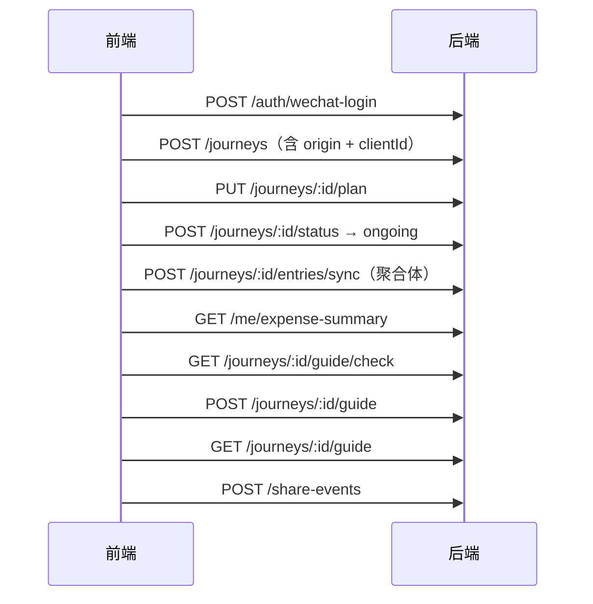

# 途记 · 前后端接口差异与后端改动建议

> 对照依据：`docs/前端对接_接口文档.md`（后端契约，2026-07-22）× 当前前端实现（`src/types`、`src/stores`、`src/pages`、`src/api`）  
> 产出目的：**列出需要后端修改 / 补齐的能力**，便于联调前对齐产品事实源。  
> 文档日期：2026-07-22

---

## 0. 结论摘要

> **2026-07-22 后端已闭环**：P0/P1 全部落地；**v2.1 联调勘误**（双字段、`pet`、全局花费增强、按旅程收藏、`CONTENT_BLOCKED`、计划默认文案等）已对齐。请以前端对接文档 **v2.1** 为准联调。

| 优先级 | 数量 | 状态 |
|--------|------|------|
| **P0 必须改** | 6 项 | ✅ 已关闭 |
| **P1 建议改** | 5 项 | ✅ 已关闭 |
| **P2 可选** | 3 项 | ✅ 裸 JSON / 秒配额已约定；`CONTENT_BLOCKED` 已接（未配微信时默认通过） |

关闭对照：

| 条目 | 状态 |
|------|------|
| 2.1 origin + destination 可选 | ✅ |
| 2.2 旅行计划 API | ✅ `GET/PUT/PATCH /journeys/:id/plan` |
| 2.3 记录聚合体 + dayIndex + expense type | ✅ |
| 2.4 枚举英文 key + 状态 planned/finished | ✅ 写入兼容别名；`pet` 规范值 |
| 2.5 列表统计 + clientId + 别名 | ✅ |
| 2.6 `GET /journeys/:id/guide` | ✅ |
| 3.1 全局花费 | ✅ `GET /me/expense-summary`（含 journeyCount/destCount/byMonth 旅程） |
| 3.2 年度预算 | ✅ `GET/PATCH /me/budget` |
| 3.3 share channel / guideId 可省 / cities | ✅ |
| 3.4 PUT 旅程 | ✅ |
| 3.5 删除统一 `deleted` | ✅ |
| v2.1 双字段 / nickname / voice 读出 / 按旅程收藏 | ✅ |

---

## 1. 模块对照总表

| 前端功能 | 前端落点 | 文档接口 | 结论 |
|----------|----------|----------|------|
| 微信登录 / 资料 / 配额 | `ProfileDrawer`、`user` store（尚未接线） | `/auth/wechat-login`、`/me`、`/me/quota` | ✅ 文档够用，前端待接 |
| 旅程 CRUD | `JourneyCreate/Edit`、`journey` store | `/journeys` | ⚠️ 缺 `origin`；枚举不一致；`destination` 必填策略冲突 |
| 旅程状态三态 | `JourneyHome` Tab | `/journeys/:id/status` | ⚠️ 枚举名不一致（`planned/finished` vs `planning/ended`） |
| **旅行计划** | `JourneyPlan`、`plan` store | **无** | ❌ **整块缺失，需新增** |
| 时间线记录 | `JourneyDetail`、`RecordSheet`、`recording` store | `/entries` + `/entries/sync` | ⚠️ **模型冲突**：前端是聚合体，文档是互斥 type |
| 地图打点 | `JourneyMap` | entries.location + 可选 POI | ✅ 可先本地点位；POI 文档已有 |
| 地点搜索 | `LocationSearch`（现硬编码） | `/map/poi`、`/map/reverse-geocode` | ✅ 文档够用，前端待接 |
| 单旅程花费 | `ExpenseDetail` | `/expense-summary` + entry.expense | ⚠️ 分类码与字段名不一致 |
| **全部旅程记账** | `ExpenseHome` tab | **无全局汇总** | ❌ **建议新增** |
| **年度预算** | `ExpenseBudget` / `yearBudgetCents` | **无** | ❌ **建议新增或明确仅本地** |
| 一键攻略 | `GuideShare`、`guide` store | `/guide`、`/guide/check`、`/guides/:id` | ⚠️ 缺「按旅程取攻略」；结构与 channel 不完全对齐 |
| 草稿箱 | `DraftBox` | `/drafts` | ✅ 文档够用，前端待接 |
| 隐私导出 / 清位置 | `ProfileDrawer`（占位） | `/me/export`、locations DELETE | ✅ 文档够用 |
| 媒体上传 / 支付 | 配额 UI 演示 | `/media/*`、`/orders` | ✅ 文档够用，前端待接 |

---

## 2. P0：必须后端修改

### 2.1 旅程增加「出发地」`origin`；放宽目的地必填

**现状**

| | 前端 | 后端文档 |
|--|------|----------|
| 出发地 | **必填** `origin`（创建页校验） | **无此字段** |
| 目的地 | **可选** `destination` | **必填** |

UI 已展示「杭州出发 → 曼谷」类路由文案（`JourneySummaryPanel`、`GuideShare`）。

**建议改动**

```http
POST /journeys
PATCH /journeys/:id
```

Body / Response 增加：

```json
{
  "origin": "杭州",
  "destination": "曼谷"
}
```

| 字段 | 建议规则 |
|------|----------|
| `origin` | 必填，1–128 字 |
| `destination` | 改为可选（允许「先定出发、后补目的地」）；若产品坚持必填，需同步改前端校验与文案 |

列表项、详情、`guide.payload.meta` 同步带回 `origin`。

---

### 2.2 新增「旅行计划」资源（屏 JourneyPlan）

前端已有完整本地模型，**文档无任何对应 API**：

```ts
// src/stores/plan.ts
interface JourneyPlan {
  journeyId: string
  places: { id; name; note; cover? }[]   // 想去的地方
  checks: { id; text; done }[]            // 出发前清单
  budgetEstimate: number                  // 预估预算（分）
}
```

流程：创建旅程 → **去规划** → 勾选清单 / 加点 → 「开始这段旅程」→ 状态变进行中。

**建议新增**

| 方法 | 路径 | 说明 |
|------|------|------|
| `GET` | `/journeys/:id/plan` | 取计划；无则返回默认空结构 + 默认 checks |
| `PUT` | `/journeys/:id/plan` | 全量覆盖 places / checks / budgetEstimate |
| `PATCH` | `/journeys/:id/plan` | 可选：局部更新（如只 toggle 某 check） |

**PUT Body 示例**

```json
{
  "places": [
    { "clientId": "p1", "name": "考山路", "note": "泼水节当晚", "coverUrl": "https://..." }
  ],
  "checks": [
    { "clientId": "c1", "text": "护照 / 签证", "done": true },
    { "clientId": "c2", "text": "机票", "done": true }
  ],
  "budgetEstimate": 600000
}
```

> 新建旅程时可自动创建默认 checks（护照/机票/酒店/换汇），与前端 DEMO 一致。  
> 删除旅程时级联删除 plan。

---

### 2.3 记录模型改为「聚合体」，与前端 Recording 对齐

**冲突本质**

前端一条记录可同时含：文字 + 多图 + 语音 + 定位 + 花费（`type` 仅作展示主色，由内容推断）。

文档 Entry 的 `type` 为互斥四选一：`text | photo | voice | location`，花费只能挂在任意 entry 上，且媒体为单 `url`。

若不改，前端 Outbox / sync 必须把一条用户操作拆成多条 entry，时间线语义、删除、攻略高光都会变形。

**建议改动（entries/sync 与 GET entries）**

1. `type` 改为可选或改为「主类型 hint」；服务端可用与前端相同的 `inferRecordType` 规则派生。  
2. 允许单条同时携带：

| 字段 | 说明 |
|------|------|
| `content` | 文字 |
| `media` | **数组**（多图）；或 `urls: string[]` |
| `voice` / `payload.durationSec` + `url` | 语音 |
| `location` | 定位 |
| `expense` | 花费（可与其它内容共存） |

3. 白名单增加主类型 `expense`（纯记一笔场景，`ExpenseForm` 会创建此类）。  
4. Response 中 `media` 保持数组；`dayIndex`（第几天，1 起）建议服务端根据 `createdAt` 与旅程 `startDate` 计算并返回，供时间线分组（前端强依赖）。

**兼容策略（若短期不能改模型）**

需书面确认：前端负责拆条 + 用 `clientId` 族关联；攻略/时间线以「逻辑聚合」展示。工作量大，**不推荐作为联调默认方案**。

---

### 2.4 枚举与标签：扩展白名单 + 稳定英文 key

#### 状态

| 前端 | 文档 |
|------|------|
| `planned` / `ongoing` / `finished` | `planning` / `ongoing` / `ended` |

**建议**：接口统一为前端已用的 `planned | ongoing | finished`（或双向别名：写入接受两套，读出固定一套并写进文档）。  
`GET /journeys?status=` 同步支持。

#### 主题 `themeTags` / `themes`

| 前端 key | 中文 |
|----------|------|
| `city_walk` | 城市漫步 |
| `island` | 海岛 |
| `food` | 美食 |
| `family_kids` | 亲子 |
| `hiking` | 徒步 |
| **`culture`** | **人文**（文档无） |
| **`shopping`** | **购物**（文档无） |
| **`relax`** | **休养**（文档无） |

文档仅 5 个中文值。前端创建页可多选上述 8 项。

**建议**：

- 存储与 API 使用 **英文 key**（利于 i18n / 校验）；展示文案前端映射。  
- 白名单扩到 8 项；若暂存中文，至少扩白名单并文档化映射表。

#### 同行人 `companions`

语义已对齐（自己/情侣/朋友/家庭/带娃/宠物），但前端为英文 key（`solo`…），文档为中文。

**建议**：同样改为英文 key 白名单；「自己」与其它互斥规则可在服务端校验（与前端一致）。

#### 花费分类

| 前端 key | 中文 |
|----------|------|
| `food` | 餐饮 |
| `stay` | 住宿 |
| `transport` | 交通 |
| `ticket` | 门票 |
| `shopping` | 购物 |
| `other` | 其他 |

文档示例为中文字符串「餐饮」「交通」。

**建议**：`expense.category` 接受英文 key（推荐）或同时接受中文并规范输出为 key，避免统计键漂移。

---

### 2.5 旅程列表 / 详情派生字段补齐

前端列表卡依赖：

| 前端字段 | 用途 | 文档现状 |
|----------|------|----------|
| `placeCount` | 地点数 | ❌ 无（计划 places 或 location entries 需可算） |
| `expenseTotal` | 已花（分） | ≈ `totalExpenseCent`（建议别名或统一命名） |
| `recordCount` | 记录数 | 详情有 `entryCount`，**列表无** |
| `clientId` | 离线创建幂等 | ❌ 旅程侧未约定 |
| `days` / `nights` | 攻略卡 | ✅ 文档已有 |

**建议**

- 列表项增加 `entryCount`（或 `recordCount`）、`placeCount`（有定位的 entry 去重 / 或 plan.places 数，需定义口径并写进文档）。  
- `POST /journeys` 支持可选 `clientId`，按用户维度幂等（与 entries 一致），支撑弱网重复提交。  
- 字段命名二选一写死：`budgetAmount` vs 前端 `budgetLimit`、`coverUrl` vs `cover` —— **建议后端为主字段，同时兼容旧别名**（文档已对 `cover` 做了兼容，请同样对待 `budgetLimit`→`budgetAmount`）。

---

### 2.6 按旅程获取攻略：`GET /journeys/:id/guide`

前端入口全是「带着 journeyId 打开攻略页」，本地 `guideApi.get(journeyId)` 也是该路径。

文档仅有：

- `POST /journeys/:id/guide` 生成  
- `GET /guides/:id` 按 guideId 拉取  

缺少「已知旅程、未知 guideId」时的读取。

**建议新增**

```http
GET /journeys/:id/guide
```

- 已有缓存：返回最新 guide（同生成结构，可无 `canGenerate`）。  
- 无缓存：`404` 或 `{ exists: false }`（前端再调 check → generate）。  

收藏接口建议兼容：Body 可省略，默认 toggle；或明确要求 `{ isFavorited: boolean }`（前端需改，二选一写死即可）。

---

## 3. P1：建议后端修改

### 3.1 全局花费汇总（记账 Tab）

`ExpenseHome` 展示：全部旅程总花费、分类占比、按月、按目的地区域、旅程行列表等。文档只有：

```http
GET /journeys/:id/expense-summary
```

前端目前本地扫全量 recordings 聚合；上云后 N 次请求浪费且难分页。

**建议新增**

```http
GET /me/expense-summary?year=2026
```

```json
{
  "year": 2026,
  "totalCent": 1280000,
  "count": 42,
  "byCategory": [{ "category": "food", "amountCent": 6800, "ratio": 0.53 }],
  "byMonth": [{ "month": 7, "amountCent": 200000 }],
  "byJourney": [
    { "journeyId": "...", "title": "...", "totalCent": 50000, "count": 8, "budgetAmount": 600000 }
  ]
}
```

---

### 3.2 用户年度预算

前端 `yearBudgetCents` + `ExpenseBudget` 页。若需多端同步：

```http
GET /me/budget
PATCH /me/budget
{ "year": 2026, "amountCent": 500000 }
```

若产品确认「仅本机」，请在接口文档「明确不做」，前端继续本地存储。

---

### 3.3 分享 channel 与攻略结构

| 项 | 前端 | 文档 | 建议 |
|----|------|------|------|
| 朋友圈 channel | `timeline` | `moments` | 接受别名或统一为 `moments` 并改前端 |
| 分享 Body | `{ journeyId, channel }` | 另需 `guideId` | 允许只传 `journeyId` 时服务端填最新 guideId |
| Guide 结构 | 扁平：`days/nights/cities/highlights[]` | 嵌套 `payload` | 生成结果增加 `cities`（有定位去重），或文档给出稳定 mapper；高光建议含 `title/note/cover` 而不只是 entry 摘要 |

---

### 3.4 旅程更新方法兼容

前端 api 桩使用 `PUT /journeys/:id`；文档为 `PATCH`。

**建议**：`PUT` 与 `PATCH` 均可用（语义：PUT 全量可选字段子集 / PATCH 局部）。

---

### 3.5 删除与写操作响应字段统一

| 场景 | 前端早期假设 | 文档 |
|------|--------------|------|
| 删除 | `{ ok: true }` | `{ deleted: true }` |

以文档为准即可，但请在全模块统一 `deleted`，避免有的接口 `ok`、有的 `deleted`。前端统一适配一层。

---

## 4. P2：可选 / 约定类

### 4.1 成功响应是否包装

- 文档：成功 **裸 JSON**。  
- 前端 `request.ts` 仍兼容 `{ code, data }`。  

保持裸 JSON 即可；请保证错误体稳定含 `code` / `message`（已有 `GUIDE_NOT_READY`、`QUOTA_EXCEEDED` 很好）。

### 4.2 内容安全 `msgSecCheck`

功能说明 R6 提到落库前内容安全。文档未暴露相关接口或异步审核态。

**建议**：文字 entry 写入路径内置微信内容安全；违规返回明确 `code`（如 `CONTENT_BLOCKED`），便于前端提示。

### 4.3 语音配额单位

文档 `voiceSec`（秒）；前端 UI 曾用「分钟」。属展示问题，后端保持秒即可，文档注明单位。

---

## 5. 建议的接口增补速查（相对现有文档）

| 优先级 | 方法 | 路径 | 动作 |
|--------|------|------|------|
| P0 | — | `/journeys` 模型 | 增 `origin`；`destination` 可选；枚举扩容；列表增统计字段；支持 `clientId` |
| P0 | GET/PUT | `/journeys/:id/plan` | **新增**旅行计划 |
| P0 | — | `/entries` 模型 | 聚合体 + 多图 + `expense` type + `dayIndex` |
| P0 | GET | `/journeys/:id/guide` | **新增**按旅程取攻略 |
| P1 | GET | `/me/expense-summary` | **新增**全局花费 |
| P1 | GET/PATCH | `/me/budget` | **新增**年度预算（或文档声明不做） |
| P1 | — | `/share-events` | channel 别名；`guideId` 可省略 |
| P2 | — | entries 写入 | 内容安全错误码 |

---

## 6. 不改后端、建议前端适配的项（避免重复开工）

以下以后端文档为准更合理，**不必强求后端改**：

1. Base URL：`/api/v1`；关掉 `USE_MOCK`；成功响应按裸 JSON 解析。  
2. 记录同步：Outbox 改为打 `POST /journeys/:id/entries/sync`，废弃假想的 `/recordings` CRUD。  
3. 状态切换：走 `POST /journeys/:id/status`，不要只靠 PATCH 旅程体改 status。  
4. 用户字段：`nick` ←→ UI `nickname`；配额用 `/me/quota`。  
5. 封面 / 预算字段映射：`cover`↔`coverUrl`，`budgetLimit`↔`budgetAmount`。  
6. 生成攻略：先 `guide/check`，再 `POST .../guide` + `{ template: "basic" }`。  
7. 媒体：先 `upload-url` → 上传 → sync/confirm；处理 `QUOTA_EXCEEDED`。  
8. 登录：`AuthModal` 现为定位授权，需另接 `wechat-login`。

---

## 7. 推荐联调顺序（后端改完后）



---

## 8. 待产品拍板的问题

1. **目的地是否允许为空？**（前端允许，文档不允许）  
2. **旅行计划是否上云？**（不上云则前端保持本地，后端可不做 2.2）  
3. **记录是否坚持「一条多内容」？**（坚持则必须做 2.3；否则前端大改拆条）  
4. **枚举存英文 key 还是中文标签？**（推荐英文 key）  
5. **年度预算是否多端同步？**  
6. **状态枚举最终用哪套名字？**（`planned/finished` vs `planning/ended`）

---

## 9. 相关文档

- 后端现约：[前端对接_接口文档.md](./前端对接_接口文档.md)  
- 前端功能：[功能说明文档.md](./功能说明文档.md)  
- 路由对照：[页面路由对照.md](./页面路由对照.md)  
- 前端类型源：`src/types/index.ts`、`src/stores/plan.ts`

---

**文档维护**：后端按本清单改完后，请回写《前端对接_接口文档.md》对应章节，并在本文「结论摘要」标注已关闭的条目。
