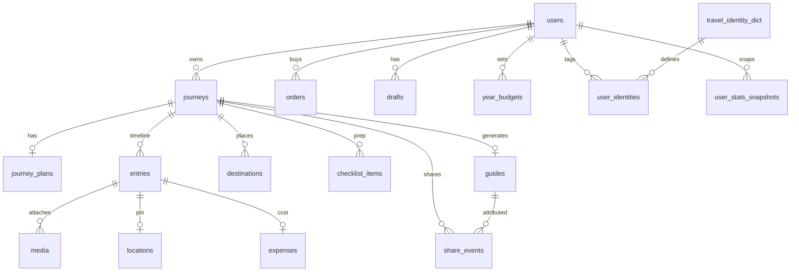

# 途记（tuji-server）后端服务现状与数据库设计

> 文档日期：2026-07-24  
> 代码包名：`tuji-server` @ `0.1.0`  
> 范围：当前仓库已落地的服务架构、模块能力、接口面与 MySQL 表结构

---

## 1. 服务概览

### 1.1 定位

途记后端为微信小程序提供 REST API：账号登录、旅程管理、时间线记录同步、目的地/准备事项、花费汇总、攻略生成与分享、配额/支付骨架、统计看板、地图 POI 等。

### 1.2 技术栈

| 层 | 选型 |
|----|------|
| 运行时 | Node.js + NestJS 10 |
| ORM | TypeORM 0.3 + `mysql2` |
| 数据库 | MySQL（库名默认 `tuji`，charset `utf8mb4`，时区 `+08:00`） |
| 鉴权 | JWT（`passport-jwt`），`Authorization: Bearer` |
| 校验 | `class-validator` + 全局 `ValidationPipe`（whitelist） |
| 文档 | Swagger：`/api/docs` |
| 配置 | `@nestjs/config` + `.env` |

### 1.3 运行约定

| 项 | 值 |
|----|----|
| 全局前缀 | `/api` |
| URI 版本 | `v1` → 业务路径形如 `/api/v1/...` |
| 默认端口 | `3000`（`PORT` 可覆盖） |
| 开发建表 | `synchronize: true`（非 production） |
| 生产建表 | `synchronize: false`，启动时 `migrationsRun` |
| 演示登录 | `POST /api/v1/auth/wechat-login`，body `{ "code": "dev_openid_demo" }` |
| 演示种子 | `npm run seed:demo` |

### 1.4 响应约定

- **多数业务接口**：成功时直接返回业务 JSON（无统一 `{ code: 0 }` 包装）。
- **统计模块**（`/stats/*`）：成功体为 `{ code: 0, message, data, range }`。
- **错误**：全局 `HttpExceptionFilter` 输出 `{ code, message, timestamp, path, ... }`；HTTP 状态码随异常走。

---

## 2. 架构与设计

### 2.1 分层结构

```
src/
├── main.ts                 # 启动、前缀、版本、Swagger（非生产）、CORS
├── app.module.ts           # 业务模块聚合
├── common/                 # 枚举、JWT Guard、DevOnlyGuard、异常过滤器
├── entities/               # TypeORM 实体（表映射）
├── infrastructure/         # 跨域基础设施
│   ├── database/           # MySQL 连接
│   ├── wechat/             # 微信登录/支付（开发 mock；生产强制配置）
│   └── storage/            # StorageDriver 策略：local | cos
├── modules/                # 按领域拆分的业务模块
└── scripts/                # seed-demo 等运维脚本
```

设计原则：

1. **领域模块化**：每个能力一个 Nest Module（Controller + Service + DTO），实体集中在 `entities/`。
2. **用户隔离**：几乎所有写读都经 `JwtAuthGuard`，按 `userId` 过滤资源归属；写操作禁止信任前端 `userId`。
3. **离线友好**：旅程 `clientId`、记录 `clientId` 做幂等；记录走 Outbox 式 `entries/sync`。
4. **派生字段不落库**：如旅程卡片 `displayStatus` / `planProgress` / `todayPlaceCount` 在 Service 层计算后返回。
5. **金额单位**：库内一律 **分（cent）**；API 对前端常同时暴露元与分。
6. **枚举英文 key**：主题、同行人、花费分类、旅程状态等写入兼容中文别名，读出归一为英文 key。
7. **存储适配器**：`STORAGE_DRIVER=local|cos`，上传契约恒为 **prepare → upload → confirm**；媒体表多态归属 `ownerType/ownerId`。

### 2.2 存储与媒体（2026-07-24 优化）

| 项 | 说明 |
|----|------|
| 驱动 | `LocalStorageDriver` / `CosStorageDriver`，经 `StorageDriverFactory` 切换 |
| 本地落盘 | `{UPLOAD_ROOT}/yyyy/mm/dd/{uuid}.{ext}`，UUID 文件名 |
| 本地回读 | `GET /api/v1/files/:y/:m/:d/:file`（防穿越；生产校验所有权） |
| 上传 API | `POST /media/prepare`、`POST /media/local-upload`、`POST /media/confirm` |
| 兼容 | 旧 `GET /media/upload-url` + 旧 confirm(`entryId+url`) 仍可用 |
| media 表 | `ownerType`=`entry\|avatar\|journey_cover\|guide\|destination`；`kind`=`image\|audio` |
| 配额 | prepare 预检、confirm 实扣；不信任前端自报 |

### 2.3 基础设施现状

| 组件 | 现状 |
|------|------|
| MySQL / TypeORM | ✅ 可用；开发期 auto sync |
| JWT 鉴权 | ✅ |
| 本地文件存储 | ✅ `STORAGE_DRIVER=local` 真落盘真回读 |
| 微信登录 | ⚠️ 无真 AppSecret 时走开发 openid；**生产禁用** `dev_openid_demo` |
| COS | ⚠️ 切换 `STORAGE_DRIVER=cos` 契约一致；预签名 SDK 待接 |
| 微信支付 | ⚠️ 订单骨架；`/pay/dev-complete` 受 `DevOnlyGuard` 保护 |
| 地图 POI | ⚠️ 无 Key 时 mock |
| Swagger | ✅ 仅非生产挂载 `/api/docs` |
| Redis 缓存 | ❌ 统计等未接缓存 |

### 2.3 核心领域关系（逻辑）



---

## 3. 业务模块与接口面

以下路径均省略前缀 `/api/v1`。除登录外默认需 Bearer Token。

### 3.1 模块一览

| 模块 | 职责 | 状态 |
|------|------|------|
| `auth` | 微信 code 登录发 JWT | ✅（开发 mock） |
| `user` / `profile` | `/me`、资料编辑、身份字典、地区、昵称校验、头像预签 | ✅ |
| `journey` | 旅程 CRUD、状态机、结束旅行、计划 CRUD、列表展示态 | ✅ |
| `recording` | 时间线 sync / 列表 / 删除；`/records` 编辑时间与内容 | ✅ |
| `destination` | 目的地 CRUD、排序（软删） | ✅ |
| `checklist` | 准备事项 CRUD、勾选、排序（软删） | ✅ |
| `expense` | 单旅程 + 全局花费汇总 | ✅ |
| `guide` | 攻略检查/生成（幂等）、收藏、分享事件 | ✅ |
| `media` | 上传 URL、确认占用配额 | ✅（存储 mock） |
| `quota` | `/me/quota`（含 limit） | ✅ |
| `payment` | 下单、dev 完成支付、notify 占位 | ⚠️ |
| `privacy` | `/me/export` 数据导出 | ✅ |
| `location` | 清除本人/旅程位置 | ✅ |
| `map` | `/map/poi`、`/map/reverse-geocode`（旧） | ✅ |
| `map`/`pois` | `/pois/nearby|search|reverse-geocode`（新，对齐前端） | ✅ |
| `draft` | 草稿箱 | ✅ |
| `stats` | overview / expenses / plans / journeys / content / storage | ✅ |

### 3.2 接口速查

#### 账号与我的

| 方法 | 路径 | 说明 |
|------|------|------|
| POST | `/auth/wechat-login` | 登录 |
| GET/PATCH | `/me` | 当前用户 |
| GET/PATCH | `/me/budget` | 年度预算 |
| GET | `/me/quota` | 配额（含 limit；语音单位秒） |
| GET | `/me/expense-summary` | 全局花费汇总 |
| GET | `/me/export` | PIPL 导出 |
| DELETE | `/me/locations` | 清全部位置 |
| GET/PATCH | `/user/profile` | 个人资料页 |
| POST | `/user/avatar/presign` | 头像预签 |
| GET | `/user/identities` | 旅行身份字典 |
| GET | `/user/regions` | 省市区 |
| POST | `/user/nickname/check` | 昵称可用性 |

#### 旅程

| 方法 | 路径 | 说明 |
|------|------|------|
| POST/GET | `/journeys` | 创建；列表支持 `?status=`、`?displayStatus=` |
| GET/PATCH/PUT/DELETE | `/journeys/:id` | 详情/更新/删除 |
| POST/PATCH | `/journeys/:id/status` | 状态跃迁 |
| POST | `/journeys/:id/finish` | 结束旅行 → `finished`（幂等） |
| GET/PUT/PATCH | `/journeys/:id/plan` | 计划（places / checks / budget） |

**持久状态 `status`**：`planned` \| `ongoing` \| `finished`（写入兼容 `planning`/`ended`）。

**展示态 `displayStatus`（只读派生）**：`planning` \| `departing`（出发前 3 日内）\| `ongoing` \| `finished`；列表还可带 `planProgress`、`confirmedCount`、`todayPlaceCount` 等。

#### 记录（时间线）

| 方法 | 路径 | 说明 |
|------|------|------|
| POST | `/journeys/:id/entries/sync` | 离线 Outbox 幂等落库 |
| GET | `/journeys/:id/entries` | 时间线 |
| GET | `/journeys/:id/records` | 记录列表别名 |
| DELETE | `/journeys/:id/entries/:entryId` | 删单条 |
| POST | `/journeys/:id/entries/delete` | 批量 / 按时间段删 |
| PATCH | `/records/:recordId` | 编辑内容等 |
| PATCH | `/records/:recordId/time` | 改 `recordedAt` / `dayIndex` |
| DELETE | `/records/:recordId` | 删除 |

条目类型：`text` \| `photo` \| `voice` \| `location` \| `expense`；一条可聚合文字 + 媒体 + 定位 + 花费。

#### 目的地 / 准备事项

| 方法 | 路径 | 说明 |
|------|------|------|
| GET/POST | `/journeys/:journeyId/destinations` | 列表 / 新建 |
| PATCH | `/journeys/:journeyId/destinations/reorder` | 排序 |
| PATCH/DELETE | `/destinations/:destinationId` | 更新 / 软删 |
| GET/POST | `/journeys/:journeyId/checklist` | 列表 / 新建 |
| PATCH | `/journeys/:journeyId/checklist/reorder` | 排序 |
| PATCH | `/checklist/:itemId` | 更新 |
| PATCH | `/checklist/:itemId/toggle` | 勾选切换 |
| DELETE | `/checklist/:itemId` | 软删 |

目的地分类：`SIGHT` \| `FOOD` \| `STAY` \| `SHOPPING` \| `OTHER`。

#### 花费 / 攻略 / 分享

| 方法 | 路径 | 说明 |
|------|------|------|
| GET | `/journeys/:id/expense-summary` | 总额、分类占比、按天 |
| GET | `/journeys/:id/guide/check` | 是否可生成 |
| GET/POST | `/journeys/:id/guide` | 获取 / 生成（已存在可 `idempotent: true`） |
| POST | `/journeys/:id/guide/favorite` | 收藏 |
| GET | `/guides/:id` | 攻略详情 |
| POST | `/guides/:id/favorite` | 收藏 |
| POST | `/share-events` | 分享归因 |
| PATCH | `/share-events/:id/viewer` | 回填 viewer |

#### 媒体 / 支付 / 草稿 / 地图 / 统计

| 方法 | 路径 | 说明 |
|------|------|------|
| GET | `/media/upload-url` | ⚠️ deprecated，请用 prepare |
| POST | `/media/prepare` | 统一上传第一步 |
| POST | `/media/local-upload` | 仅 local：写盘 |
| POST | `/media/confirm` | 激活 + 扣配额（兼容旧 entryId+url） |
| GET | `/files/:y/:m/:d/:file` | 本地回读 |
| POST | `/orders` | 创建订单 |
| POST | `/pay/dev-complete` | 开发环境完成支付 |
| POST | `/pay/notify` | 支付回调占位 |
| GET/PUT/DELETE | `/drafts`… | 草稿 |
| GET | `/map/poi`、`/map/reverse-geocode` | 旧地图接口 |
| GET | `/pois/nearby`、`/pois/search`、`/pois/reverse-geocode` | 新 POI（`{ list, total }` + lat/lng） |
| GET | `/stats/overview` 等 6 端点 | 统计看板（统一包装 + range） |
| DELETE | `/journeys/:id/locations` | 清旅程位置 |

更细的请求/响应示例见：

- [前端对接_接口文档.md](./前端对接_接口文档.md)
- [统计模块_接口文档.md](./统计模块_接口文档.md)
- [目的地与准备事项_接口文档.md](./目的地与准备事项_接口文档.md)
- [前后端接口同步_后端落地说明.md](./前后端接口同步_后端落地说明.md)

---

## 4. 数据库设计

### 4.1 总则

- **主键**：多数表 UUID（`PrimaryGeneratedColumn('uuid')`）；字典表与用户身份关联表用业务主键。
- **外键**：TypeORM 关系 + `onDelete: 'CASCADE'`（旅程删则级联计划/条目/目的地等）。
- **软删除**：`destinations.deletedAt`、`checklist_items.deletedAt`；查询默认排除已删。
- **JSON 列**：计划 places/checks、主题/同行人、攻略 payload、草稿 payload、目的地 images 等。
- **金额**：`*Cent` / `budgetAmount` 等均为 **整数分**。
- **幂等**：`journeys (userId, clientId)` 唯一；`entries.clientId` 全局唯一；`guides.journeyId` 唯一。

### 4.2 表清单

| 表名 | 实体 | 说明 |
|------|------|------|
| `users` | User | 账号、资料、配额 |
| `user_identities` | UserIdentity | 用户 ↔ 旅行身份 |
| `travel_identity_dict` | TravelIdentityDict | 身份字典 |
| `journeys` | Journey | 旅程主表 |
| `journey_plans` | JourneyPlan | 1:1 计划（JSON places/checks） |
| `destinations` | Destination | 目的地表（软删） |
| `checklist_items` | ChecklistItem | 准备事项（软删） |
| `entries` | Entry | 时间线条目聚合体 |
| `media` | Media | 照片/语音 |
| `locations` | Location | 定位点（1:1 entry） |
| `expenses` | Expense | 花费（1:1 entry） |
| `guides` | Guide | 攻略缓存 |
| `share_events` | ShareEvent | 分享归因 |
| `year_budgets` | YearBudget | 用户年度预算 |
| `orders` | Order | 付费订单 |
| `drafts` | Draft | 草稿箱 |
| `user_stats_snapshots` | UserStatsSnapshot | 统计日快照 |

> 说明：`journey_plans.checks` 与表 `checklist_items` 并存——前者偏计划页 JSON；后者为独立准备事项资源，卡片进度优先看 checklist（无则回退 plan.checks）。

### 4.3 表结构明细

#### `users`

| 列 | 类型 | 说明 |
|----|------|------|
| id | uuid PK | |
| openid | varchar(64) UK | 微信 openid |
| nick | varchar(12) | 昵称（API 主字段 nickname） |
| avatar | varchar(512) | |
| gender | varchar(16) | `MALE`/`FEMALE`/`UNKNOWN` |
| birthday | date | |
| provinceCode / cityCode | char(6) | |
| departureCity | varchar(64) | |
| bio | varchar(40) | |
| phone | varchar(64) | 应用层约定加密；响应脱敏 |
| plan | varchar(16) | `free`/`pro` |
| quotaPhoto / usedPhoto | int | 照片配额/已用 |
| quotaVoiceSec / usedVoiceSec | int | 语音秒配额/已用 |
| createdAt / updatedAt | datetime | |

#### `travel_identity_dict` / `user_identities`

- 字典：`code` PK、`name`、`sort`
- 关联：复合主键 `(userId, identityCode)`

#### `journeys`

| 列 | 类型 | 说明 |
|----|------|------|
| id | uuid PK | |
| userId | varchar(36) Index | → users |
| clientId | varchar(64) | 离线幂等；与 userId 唯一 |
| title | varchar(128) | |
| origin | varchar(128) | 出发地 |
| destination | varchar(128) | 目的地文案（可选） |
| startDate / endDate | date | |
| cover | varchar(512) | 封面 URL（实体字段 coverUrl） |
| status | varchar(16) | planned/ongoing/finished |
| themeTags / companions | json | 英文 key 数组 |
| budgetAmount | int | 预算上限（分） |
| isPublic | bool | |
| syncVersion | int | |
| createdAt / updatedAt | datetime | |

#### `journey_plans`

| 列 | 类型 | 说明 |
|----|------|------|
| id | uuid PK | |
| journeyId | varchar(36) UK | 1:1 |
| places | json | `PlanPlace[]`（含 lat/lng/locationName/category/dayIndex/images） |
| checks | json | `PlanCheck[]`（clientId/text/done） |
| budgetEstimate | int | 预估预算（分） |
| createdAt / updatedAt | datetime | |

#### `destinations`

| 列 | 类型 | 说明 |
|----|------|------|
| id | uuid PK | |
| journeyId | varchar(36) | Index(journeyId, deletedAt) |
| name | varchar(60) | |
| latitude / longitude | decimal | 可空 |
| address | varchar(200) | |
| category | varchar(16) | SIGHT/FOOD/… |
| note | varchar(240) | |
| images | json | COS URL，最多 9 |
| isMust | bool | |
| dayIndex | int | null=未排天 |
| sortOrder | int | |
| deletedAt | datetime | 软删 |
| createdAt / updatedAt | datetime | |

#### `checklist_items`

| 列 | 类型 | 说明 |
|----|------|------|
| id | uuid PK | |
| journeyId | varchar(36) | Index(journeyId, deletedAt) |
| title | varchar(60) | |
| isDefaultChecked | bool | 模板语义 |
| remindBeforeDays | int | null=不提醒 |
| sortOrder | int | |
| isChecked | bool | 实际勾选 |
| deletedAt | datetime | 软删 |
| createdAt / updatedAt | datetime | |

#### `entries`

| 列 | 类型 | 说明 |
|----|------|------|
| id | uuid PK | |
| journeyId | varchar(36) | 索引：journey+createdAt；journey+dayIndex+recordedAt |
| type | varchar(16) | text/photo/voice/location/expense |
| content | text | |
| clientId | varchar(64) UK | 离线幂等 |
| syncVersion | int | |
| status | varchar(16) | 默认 synced |
| payload | json | 灵活扩展 |
| recordedAt | datetime | 可编辑发生时间 |
| dayIndex | int | 可编辑第几天 |
| createdAt / updatedAt | datetime | |

#### `media`

多态媒体（不再绑死 `entryId` FK）：

| 列 | 类型 | 说明 |
|----|------|------|
| id | uuid PK | |
| ownerType | varchar(24) | entry / avatar / journey_cover / guide / destination |
| ownerId | varchar(36) | 归属实体 id |
| kind | varchar(12) | image \| audio（兼容写入 photo/voice） |
| url / thumbUrl | varchar(512) | |
| mime / ext | | |
| sizeBytes | bigint | |
| width / height / durationSec | int | |
| checksum | varchar(64) | sha256 去重 |
| sortOrder | int | |
| status | varchar(12) | pending \| active \| deleted |
| storageTier | varchar(8) | hot \| cold |
| driver | varchar(8) | local \| cos |
| storageKey | varchar(255) | 相对对象 key |
| createdBy | varchar(36) | |
| deletedAt | datetime | 软删 |
| createdAt / updatedAt | datetime | |

索引：`(ownerType, ownerId, deletedAt)`、`checksum`、`(createdBy, createdAt)`。

#### `users` 扩展

| 列 | 说明 |
|----|------|
| unionid | 微信跨应用（可空唯一） |
| appId | 小程序 appId |
| role | user \| admin |
| status | active \| blocked \| deleted |
| deletedAt | 账号软删 |

子资源说明：媒体统一走 `media` 表；`locations` / `expenses` 仍 1:1 挂 `entries`。

#### `guides` / `share_events`

- `guides`：每旅程一条；`template`、`payload` JSON、`coverUrl`、`isFavorited`、`totalCost`
- `share_events`：`journeyId`、`guideId`、`channel`(friend/moments/image)、`sharerId`、`viewerId`、`sharedAt`

#### `year_budgets` / `orders` / `drafts`

- `year_budgets`：`(userId, year)` 唯一，`amountCent`
- `orders`：`product`(capacity_pack/pro_monthly)、`amountCent`、`status`(pending/paid/closed)、`transactionId`、`paidAt`
- `drafts`：`kind`(entry/journey)、`payload` JSON、可选 `journeyId`

#### `user_stats_snapshots`

| 列 | 类型 | 说明 |
|----|------|------|
| id | uuid PK | |
| userId + date | 唯一 | 日快照 |
| totalRecords / totalDays / totalPlaces / streakDays | int | 物化计数 |
| totalExpense | bigint | 累计花费（分） |
| updatedAt | datetime | |

统计接口可实时聚合 + 读快照；生产侧建议后续补 Redis 与定时物化。

### 4.4 索引与约束摘要

| 约束/索引 | 表 |
|-----------|-----|
| UK `openid` | users |
| UK `(userId, clientId)` | journeys |
| UK `journeyId` | journey_plans, guides |
| UK `clientId` | entries |
| UK `entryId` | locations, expenses |
| UK `(userId, year)` | year_budgets |
| UK `(userId, date)` | user_stats_snapshots |
| Index `(journeyId, deletedAt)` | destinations, checklist_items |
| Index `(journeyId, createdAt)` 等 | entries |

---

## 5. 关键业务规则（实现侧）

1. **旅程状态机**：`planned → ongoing → finished`；`POST .../finish` 允许 planned/ongoing 直接结束；已 finished 幂等返回；若 `endDate` 在未来可收口为今天。
2. **计划进度**：优先 `checklist_items` 勾选比例；无 checklist 时用 `journey_plans.checks`。
3. **记录 sync**：按 `clientId` upsert；可挂 media/location/expense；推断 `type`。
4. **攻略生成**：检查记录/花费等门槛；已生成再次 POST 可返回已有并带 `idempotent`。
5. **配额**：确认媒体上传时累加 `usedPhoto` / `usedVoiceSec`；`/me/quota` 暴露剩余与 limit。
6. **统计 range**：`rangeType=all|year|month|custom`，响应带 `range` 元数据。

---

## 6. 能力成熟度与已知缺口

| 项 | 状态 |
|----|------|
| 旅程 / 计划 / 记录 / 花费 / 攻略主链路 | ✅ 可联调 |
| 目的地 / 准备事项独立资源 | ✅ |
| 旅程卡片展示态字段 | ✅ |
| 统计六端点 | ✅（缓存/物化可增强） |
| `/pois/*` 对齐前端 | ✅ |
| 微信真登录 / COS / 微信支付 | ⚠️ mock 或半成品 |
| 地图真 Key | ⚠️ 可选配置 |
| 生产 migration 脚本完备性 | ⚠️ 依赖启动 migrations；开发靠 synchronize |
| 草稿「旅程实体」独立建模 | ⚠️ 当前 drafts 表 JSON |
| Redis / 统计预聚合任务 | ❌ |

---

## 7. 本地运维速查

```bash
cd server
cp .env.example .env   # DB_HOST / DB_DATABASE=tuji 等
npm install
npm run build
npm run seed:demo      # 可选：国内景点演示数据
npm run start:prod     # 或 start:dev
# Swagger: http://localhost:3000/api/docs
```

环境变量要点：`DB_*`、`JWT_SECRET`、`TENCENT_MAP_KEY`/`AMAP_KEY`、微信与 COS 相关（未配则走开发路径）。

---

## 8. 相关文档索引

| 文档 | 用途 |
|------|------|
| [开发文档.md](./开发文档.md) | 早期能力与启动说明 |
| [前端对接_接口文档.md](./前端对接_接口文档.md) | 联调契约主文档 |
| [渡清川_前后端接口同步说明_2026-07-24.md](./渡清川_前后端接口同步说明_2026-07-24.md) | 前后端对齐清单 |
| [前后端接口同步_后端落地说明.md](./前后端接口同步_后端落地说明.md) | 落地差异说明 |
| [统计模块_接口文档.md](./统计模块_接口文档.md) | 统计 API |
| [目的地与准备事项_接口文档.md](./目的地与准备事项_接口文档.md) | destinations / checklist |
| [渡清川_旅程卡片_后端改动说明.md](./渡清川_旅程卡片_后端改动说明.md) | displayStatus 等 |
| [数据模型对照.md](./数据模型对照.md) | 历史表对照（若与本文冲突，以实体与本文为准） |
